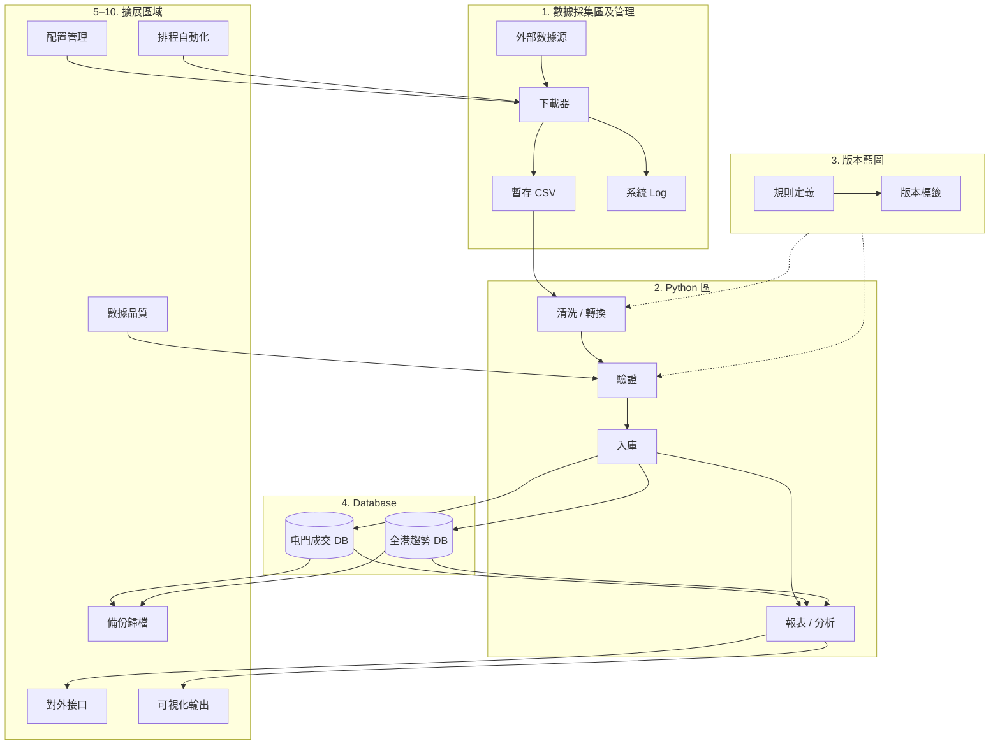

# 香港物業成交追蹤系統 — 整體藍圖

> 目標：建立一套可持續運作嘅物業成交數據系統，由採集、清洗、入庫、分析到輸出，分工清晰、版本可追溯。

---

## 系統總覽



---

## 目錄結構

```
property/
├── data/                          # 1. 數據採集區及管理
│   ├── staging/                   # 暫存原始 CSV（未處理）
│   │   ├── tuen_mun/              # 屯門區成交
│   │   ├── primary/               # 全港一手
│   │   ├── secondary/             # 全港二手
│   │   └── mortgage/              # 高成數按揭（準則及保費）
│   ├── processed/                 # 已清洗、待入庫 CSV
│   ├── archive/                   # 歸檔（按年月分）
│   └── downloads/                 # 下載暫存（raw）
│
├── logs/                          # 系統 Log
│   ├── ingestion/                 # 採集 log
│   ├── etl/                       # 清洗 log
│   ├── database/                  # 入庫 log
│   └── system/                    # 系統級 log
│
├── src/                           # 2. Python 區
│   ├── ingestion/                 # 下載 & 採集
│   ├── etl/                       # 清洗 & 轉換
│   ├── validation/                # 數據驗證
│   ├── database/                  # 入庫 & 查詢
│   ├── analysis/                  # 趨勢分析
│   ├── reporting/                 # 報表生成
│   └── utils/                     # 共用工具
│
├── blueprints/                    # 3. 版本藍圖
│   ├── ingestion/                 # 採集規則（來源、頻率、欄位對應）
│   ├── etl/                       # 清洗規則（標準化、去重）
│   ├── validation/                # 驗證規則（範圍、必填）
│   └── analysis/                  # 分析規則（分類、指標定義）
│
├── database/                      # 4. Database
│   ├── schemas/                   # Schema 定義（SQL / DDL）
│   ├── migrations/                # 版本遷移
│   └── seeds/                     # 初始 / 測試數據
│
├── config/                        # 5. 配置管理
│   ├── settings.yaml              # 主配置
│   ├── sources.yaml               # 數據源定義
│   └── districts.yaml             # 區域對照（18 區）
│
├── schedules/                     # 6. 排程自動化
│   └── cron/                      # Cron 定義
│
├── tests/                         # 7. 測試
│   ├── unit/
│   └── integration/
│
├── output/                        # 8. 可視化 & 報表輸出
│   ├── reports/
│   ├── charts/
│   └── exports/
│
├── docs/                          # 文檔
│   ├── BLUEPRINT.md               # 本文件
│   ├── DATA_DICTIONARY.md         # 數據字典
│   └── SOURCES.md                 # 數據源說明
│
├── requirements.txt
├── .env.example
└── README.md
```

---

## 區域 1：數據採集區及管理

### 職責
- 暫存原始 CSV，唔直接改動
- 統一管理下載路徑同方法
- 記錄每次採集嘅系統 log

### 子模組

| 子模組 | 說明 | 路徑 |
|--------|------|------|
| 暫存區 | 原始 CSV，按來源 / 區域分 | `data/staging/` |
| 下載暫存 | HTTP / 爬蟲下載嘅 raw 檔 | `data/downloads/` |
| 已處理區 | ETL 後、入庫前 | `data/processed/` |
| 歸檔區 | 按月封存，減輕主目錄壓力 | `data/archive/YYYY-MM/` |
| 系統 Log | 採集、ETL、入庫分開記錄 | `logs/` |

### 下載路徑 & 方法（建議）

| 數據類型 | 建議來源 | 下載方法 | 暫存路徑 | 頻率 |
|----------|----------|----------|----------|------|
| 屯門成交 | 土地註冊處 / 中原 / 利嘉閣 | API 或定時爬蟲 | `data/staging/tuen_mun/` | 每週 |
| 全港一手 | 運輸及物流局一手住宅成交 | 官方 CSV / PDF 解析 | `data/staging/primary/` | 每月 |
| 全港二手 | 差餉物業估價署 / 地產代理 | 爬蟲或第三方 API | `data/staging/secondary/` | 每週 |
| 高成數按揭 | 香港按證保險有限公司 | 官方 PDF 下載 | `data/staging/mortgage/` | 每季 |

### Log 管理規範

```
logs/
├── ingestion/YYYY-MM-DD_<source>.log   # 下載成功/失敗、檔案大小、行數
├── etl/YYYY-MM-DD_<pipeline>.log      # 清洗步驟、丟棄行數
├── database/YYYY-MM-DD_<table>.log     # 入庫筆數、重複跳過
└── system/app.log                      # 應用級錯誤
```

**Log 格式建議（JSON Lines）：**
```json
{"ts": "2026-08-04T13:00:00", "level": "INFO", "module": "ingestion", "source": "tuen_mun", "action": "download", "rows": 1523, "file": "data/staging/tuen_mun/2026-08-04.csv"}
```

---

## 區域 2：Python 區

### 職責
按用途分拆 script，每個模組只做一件事。

### 模組分工

| 模組 | 路徑 | 用途 | 主要腳本（建議命名） |
|------|------|------|----------------------|
| 採集 | `src/ingestion/` | 下載、爬蟲 | `download_tuen_mun.py`, `download_primary.py`, `download_mortgage.py` |
| 清洗 | `src/etl/` | 標準化、去重、合併 | `clean_tuen_mun.py`, `normalize_address.py` |
| 驗證 | `src/validation/` | 欄位檢查、異常偵測 | `validate_schema.py`, `check_outliers.py` |
| 入庫 | `src/database/` | 寫入 DB、查詢 | `load_tuen_mun.py`, `load_trends.py` |
| 分析 | `src/analysis/` | 趨勢計算、指標 | `calc_price_trend.py`, `district_compare.py` |
| 報表 | `src/reporting/` | 輸出 CSV / Excel / 圖表 | `export_monthly_report.py` |
| 工具 | `src/utils/` | Log、配置、日期 | `logger.py`, `config.py`, `date_helper.py` |

### 執行流程（Pipeline）

```
ingestion → etl → validation → database → analysis → reporting
```

每個階段可獨立執行，透過 CLI 或排程串連：
```bash
python -m src.ingestion.download_tuen_mun
python -m src.etl.clean_tuen_mun
python -m src.validation.validate_schema --source tuen_mun
python -m src.database.load_tuen_mun
```

---

## 區域 3：版本藍圖

### 職責
唔同情況用唔同規則，每套規則有版本號，可追溯。

### 藍圖類型

| 類型 | 路徑 | 內容示例 |
|------|------|----------|
| 採集藍圖 | `blueprints/ingestion/` | 來源 URL、請求頭、重試次數、欄位對應 |
| ETL 藍圖 | `blueprints/etl/` | 地址標準化規則、單位換算、去重 key |
| 驗證藍圖 | `blueprints/validation/` | 必填欄位、價格合理範圍、日期格式 |
| 分析藍圖 | `blueprints/analysis/` | 趨勢定義（按月/季）、一手 vs 二手分類 |

### 版本命名規範

```
<類型>_<區域/用途>_v<主版本>.<次版本>.yaml

例：
  ingestion_tuen_mun_v1.0.yaml
  etl_primary_v2.1.yaml
  validation_secondary_v1.3.yaml
```

### 藍圖文件結構示例

```yaml
# blueprints/etl/tuen_mun_v1.0.yaml
version: "1.0"
effective_date: "2026-01-01"
description: "屯門區成交清洗規則 v1"

rules:
  address_normalize:
    - strip_whitespace
    - unify_floor_format      # "3/F" 統一格式
  dedup:
    key: [estate_name, block, floor, unit, transaction_date, price]
  price:
    currency: HKD
    min: 100000
    max: 100000000
```

### 情況對應（何時用邊個藍圖）

| 情況 | 使用藍圖 |
|------|----------|
| 屯門區新成交入庫 | `ingestion_tuen_mun_v1.0` + `etl_tuen_mun_v1.0` |
| 全港一手月度統計 | `ingestion_primary_v1.0` + `analysis_trend_v1.0` |
| 全港二手週報 | `ingestion_secondary_v1.0` + `analysis_trend_v1.0` |
| 數據源改版（欄位變） | 升級藍圖主版本，舊數據用舊藍圖重跑 |

---

## 區域 4：Database

### 兩個核心數據庫

#### DB-A：屯門成交（樓盤明細）

**用途：** 屯門區每宗成交嘅詳細記錄，支援樓盤級查詢。

| 表名 | 說明 | 主要欄位 |
|------|------|----------|
| `tuen_mun_transactions` | 成交主表 | id, estate_name, block, floor, unit, area_sqft, price, price_per_sqft, transaction_date, source, created_at |
| `tuen_mun_estates` | 屋苑字典 | estate_id, estate_name, district, developer, completion_year |
| `tuen_mun_import_log` | 入庫記錄 | import_id, file_name, rows_imported, blueprint_version, imported_at |

**索引建議：**
- `(estate_name, transaction_date)`
- `(transaction_date)`
- `(price_per_sqft)` — 用於異常偵測

#### DB-B：全港成交趨勢（一手 & 二手）

**用途：** 聚合層，記錄全港及各區趨勢，唔需要每宗明細。

| 表名 | 說明 | 主要欄位 |
|------|------|----------|
| `trend_monthly` | 月度趨勢 | id, period (YYYY-MM), market_type (primary/secondary), district, transaction_count, avg_price, median_price, total_volume, avg_price_per_sqft |
| `trend_quarterly` | 季度趨勢 | 同上，period 為 YYYY-Qn |
| `trend_district_rank` | 區域排名 | period, market_type, district, rank_by_volume, rank_by_price_change |

**市場類型定義：**
- `primary` — 一手（發展商直接出售）
- `secondary` — 二手（市場轉手）

### 數據流向

```
屯門 CSV ──→ [ETL] ──→ DB-A (明細)
全港 CSV ──→ [ETL] ──→ DB-B (趨勢聚合)
DB-A 明細 ──→ [分析] ──→ DB-B (補充屯門趨勢)
```

### 技術選型建議

| 方案 | 適合場景 | 備註 |
|------|----------|------|
| SQLite | 初期、單機、數據量 < 100 萬行 | 零配置，適合起步 |
| PostgreSQL | 中期、多區擴展、需要並發查詢 | 推薦長期方案 |
| DuckDB | 分析為主、大量 CSV 聚合 | 可與 SQLite 並用 |

---

## 區域 5–10：建議新增區域

### 5. 配置管理（`config/`）

**為何需要：** 下載 URL、API key、路徑唔應寫死在 code 入面。

| 文件 | 內容 |
|------|------|
| `settings.yaml` | 全局設定（DB 路徑、log 級別） |
| `sources.yaml` | 各數據源 URL、認證、更新頻率 |
| `districts.yaml` | 香港 18 區對照表 |
| `.env` | 敏感資料（API key），不入 git |

### 6. 排程自動化（`schedules/`）

**為何需要：** 成交數據需要定期更新，人手跑唔可靠。

| 任務 | 頻率 | 腳本 |
|------|------|------|
| 屯門成交下載 | 每週一 06:00 | `download_tuen_mun.py` |
| 全港二手下載 | 每週三 06:00 | `download_secondary.py` |
| 全港一手下載 | 每月 1 日 06:00 | `download_primary.py` |
| 趨勢重算 | 每次入庫後 | `calc_price_trend.py` |
| Log 清理 | 每月 | 刪除 90 日前 log |

### 7. 數據品質監控（`src/validation/` + 藍圖）

**為何需要：** 物業數據常見問題：重複、價格異常、地址不一致。

| 檢查項 | 規則 |
|--------|------|
| 完整性 | 必填欄位唔可空 |
| 唯一性 | 同一成交唔重複入庫 |
| 合理性 | 呎價 $3,000–$80,000 範圍（可調） |
| 時效性 | 成交日期唔可晚於今日 |
| 一致性 | 地址格式符合藍圖 |

### 8. 備份與歸檔（`data/archive/`）

**為何需要：** 數據源可能改版，需要保留原始檔以便重跑。

- 每次入庫後，原始 CSV 移至 `data/archive/YYYY-MM/`
- DB 定期備份（SQLite → `.backup` 檔）
- 藍圖版本與入庫記錄綁定，可追溯

### 9. 可視化 & 報表輸出（`output/`）

**為何需要：** 數據入庫後需要給人睇。

| 輸出類型 | 路徑 | 工具建議 |
|----------|------|----------|
| 月度報告 | `output/reports/` | Excel / PDF |
| 趨勢圖表 | `output/charts/` | matplotlib / plotly |
| 數據導出 | `output/exports/` | CSV 給外部使用 |

### 10. 數據字典 & 文檔（`docs/`）

**為何需要：** 欄位定義、來源說明，避免日後混淆。

| 文件 | 內容 |
|------|------|
| `DATA_DICTIONARY.md` | 每個欄位嘅定義、單位、示例 |
| `SOURCES.md` | 各數據源 URL、更新頻率、限制 |
| `BLUEPRINT.md` | 本藍圖（系統總覽） |

---

## 數據生命週期

```
採集 → 暫存 → 清洗 → 驗證 → 入庫 → 分析 → 輸出
  │       │       │       │       │       │       │
  log    staging  ETL    品質    DB-A/B  趨勢   報表
  │                                       │
  └──────────── 歸檔 ←───────────────────┘
```

1. **採集** — 從外部源下載，寫入 `data/staging/`，記錄 ingestion log
2. **暫存** — 原始 CSV 保留，唔改動
3. **清洗** — 按藍圖規則轉換，輸出到 `data/processed/`
4. **驗證** — 品質檢查，不合格行寫入 error log
5. **入庫** — 寫入 DB-A（明細）或 DB-B（趨勢）
6. **分析** — 計算趨勢指標，更新 DB-B
7. **輸出** — 生成報表 / 圖表
8. **歸檔** — 原始檔移至 `data/archive/`

---

## 實施路線圖

### Phase 1 — 基礎建設（起步）
- [ ] 建立目錄結構
- [ ] 配置管理（`config/settings.yaml`）
- [ ] Log 工具（`src/utils/logger.py`）
- [ ] 屯門成交 DB schema（SQLite）
- [ ] 第一個採集藍圖 + 下載腳本

### Phase 2 — 屯門區 MVP
- [ ] 屯門成交 ETL 藍圖 + 清洗腳本
- [ ] 入庫流程（CSV → DB-A）
- [ ] 基本驗證規則
- [ ] 手動執行 pipeline 測試

### Phase 3 — 全港趨勢
- [ ] 一手 / 二手採集藍圖
- [ ] DB-B 趨勢表
- [ ] 趨勢分析腳本
- [ ] 月度報表輸出

### Phase 4 — 自動化 & 品質
- [ ] Cron 排程
- [ ] 數據品質監控
- [ ] 歸檔流程
- [ ] 單元測試

### Phase 5 — 擴展
- [ ] 擴展至其他區（元朗、沙田等）
- [ ] 可視化儀表板
- [ ] API 對外接口（如需要）

---

## 技術棧建議

| 層級 | 建議 | 備註 |
|------|------|------|
| 語言 | Python 3.11+ | 數據處理生態成熟 |
| 數據庫 | SQLite → PostgreSQL | 先簡後繁 |
| 配置 | YAML + python-dotenv | 藍圖同配置分開 |
| 日誌 | loguru 或標準 logging | JSON Lines 格式 |
| 排程 | cron / APScheduler | 初期 cron 夠用 |
| 測試 | pytest | 驗證藍圖規則 |
| 依賴管理 | requirements.txt | 後期可轉 poetry |

---

## 命名規範

| 類型 | 規範 | 示例 |
|------|------|------|
| CSV 檔 | `YYYY-MM-DD_<source>_<district>.csv` | `2026-08-04_centaline_tuen_mun.csv` |
| 藍圖 | `<type>_<scope>_v<major>.<minor>.yaml` | `etl_tuen_mun_v1.0.yaml` |
| Log | `YYYY-MM-DD_<module>.log` | `2026-08-04_ingestion.log` |
| DB 表 | `snake_case` | `tuen_mun_transactions` |
| Python 模組 | `snake_case` | `download_tuen_mun.py` |

---

*最後更新：2026-08-04*
