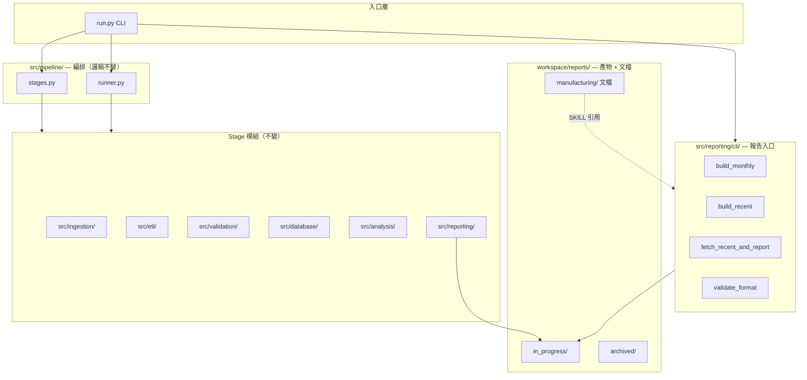

# 目錄重整方案

> 版本：v1.0 · 日期：2026-09-02  
> 原則：**Pipeline 邏輯不變，只重新編排目錄與入口**

---

## 1. 重整目標

| 目標 | 說明 |
|------|------|
| 單一 CLI 入口 | 所有操作經 `run.py`，報告製造腳本搬入 `src/reporting/cli/` |
| Pipeline 編排分層 | `run.py` 只做參數解析；stage 邏輯集中 `src/pipeline/` |
| 工作區職責清晰 | `workspace/` 只放報告產物；規格文檔留 `manufacturing/` |
| 消除 path hack | 刪除 `sys.path.insert`；統一 `from src.xxx` |
| 文檔與實作一致 | 移除未建立嘅 `output/` 規劃描述 |

**唔改動嘅範圍：**

- 採集 → ETL → 驗證 → 入庫 → 分析 → 報告 嘅 **stage 順序同函數行為**
- 藍圖 `blueprints/`、配置 `config/`、DB schema
- 報告 13 欄格式（`report_columns.py`）

---

## 2. 重整前後對照

### 2.1 頂層目錄

```
【重整前】                              【重整後】
property/                               property/
├── run.py          （220 行 CLI+邏輯）   ├── run.py          （薄 CLI，~80 行）
├── src/                                ├── src/
│   ├── ingestion/ …                    │   ├── pipeline/       ★ 新增：編排層
│   ├── etl/ …                          │   ├── ingestion/ …    （不變）
│   ├── reporting/ …                    │   ├── reporting/
│   └── …                               │   │   ├── cli/        ★ 新增：報告 CLI
│                                       │   │   └── templates/  ★ 新增
├── workspace/reports/                  │   └── …
│   ├── in_progress/                    ├── workspace/reports/
│   ├── archived/                       │   ├── in_progress/    （不變）
│   └── manufacturing/                  │   ├── archived/       （不變）
│       ├── *.py      ← path hack       │   ├── manufacturing/  （只留文檔 + 兼容 wrapper）
│       ├── SKILL.md                    │   └── templates/      （可選，或放 src）
│       └── templates/                  ├── docs/
├── docs/                               │   └── RESTRUCTURE_PLAN.md  ★ 本文件
└── output/         ← 規劃但未建         └── （刪除規劃引用）
```

### 2.2 Pipeline 編排層（新增）

```
src/pipeline/
├── __init__.py
├── stages.py      # 各 stage 函數（由 run.py 搬出，邏輯不變）
└── runner.py      # run_all() 串連 stages
```

**Stage 順序（不變）：**

```
init → ingest → etl → validate → load → analyze → report
```

### 2.3 報告 CLI（由 manufacturing 搬出）

```
src/reporting/cli/
├── __init__.py
├── build_monthly.py           ← build_report.py
├── build_recent.py            ← build_tuen_mun_recent_report.py
├── fetch_recent_and_report.py ← 同名搬移
└── validate_format.py         ← validate_report_format.py
```

### 2.4 工作區 manufacturing（只留文檔）

```
workspace/reports/manufacturing/
├── SKILL.md
├── REPORT_FORMAT.md
├── FORMAT_CHANGELOG.md
├── build_report.py              ← 薄 wrapper（向後兼容）
├── build_tuen_mun_recent_report.py
├── fetch_recent_and_report.py
└── validate_report_format.py
```

Wrapper 只 `import` 新位置嘅 `main()`，**唔再** `sys.path.insert`。

---

## 3. 檔案搬遷對照表

| 原路徑 | 新路徑 | 動作 |
|--------|--------|------|
| `run.py`（stage 函數） | `src/pipeline/stages.py` | 搬出 |
| `run.py`（run-all） | `src/pipeline/runner.py` | 搬出 |
| `workspace/.../build_report.py` | `src/reporting/cli/build_monthly.py` | 搬移 + 改名 |
| `workspace/.../build_tuen_mun_recent_report.py` | `src/reporting/cli/build_recent.py` | 搬移 + 改名 |
| `workspace/.../fetch_recent_and_report.py` | `src/reporting/cli/fetch_recent_and_report.py` | 搬移 |
| `workspace/.../validate_report_format.py` | `src/reporting/cli/validate_format.py` | 搬移 + 改名 |
| `workspace/.../templates/monthly_report.md` | `src/reporting/templates/monthly_report.md` | 搬移 |
| `infer_recent_deals._fetch_recent_transactions` | 公開 `fetch_recent_transactions()` | 改 import 路徑（行為不變） |

---

## 4. CLI 對照（新舊等價）

### 4.1 Pipeline（不變）

```bash
python run.py init
python run.py ingest [--source all|tuen_mun|primary|secondary]
python run.py etl
python run.py validate
python run.py load
python run.py analyze
python run.py report              # 月度報告 → in_progress/
python run.py run-all
python run.py workspace list
python run.py workspace archive <檔名>
```

### 4.2 報告製造（新入口，推薦）

```bash
python run.py report monthly
python run.py report recent [--days 14]
python run.py report fetch-recent [--days 14] [--no-enrich]
python run.py report validate <路徑>
```

### 4.3 向後兼容（舊路徑仍可用）

```bash
python workspace/reports/manufacturing/build_report.py
python workspace/reports/manufacturing/build_tuen_mun_recent_report.py --days 14
python workspace/reports/manufacturing/fetch_recent_and_report.py --days 14
python workspace/reports/manufacturing/validate_report_format.py <路徑>
```

---

## 5. 配置變更

### `config/settings.yaml`

```yaml
paths:
  # 移除 output: "output"（未使用）
  workspace_reports_manufacturing: "workspace/reports/manufacturing"  # 文檔 + 兼容 wrapper
  reporting_templates: "src/reporting/templates"                      # 新增（可選）
```

### `src/reporting/workspace.py`

- `manufacturing_dir()` 保留 — 指向文檔目錄
- `ensure_workspace_dirs()` 仍建立 manufacturing（文檔目錄）

---

## 6. 分階段執行

### Phase A — 本次實施（只編排，不改 pipeline）

- [x] 新增 `src/pipeline/`
- [x] 新增 `src/reporting/cli/`
- [x] 精簡 `run.py`
- [x] manufacturing 改為 wrapper + 文檔
- [x] 更新 README / BLUEPRINT / SKILL 路徑引用
- [x] 跑通 `pytest tests/ -v`

### Phase B — 後續（唔影響 pipeline）

- [ ] Provider 抽象（`src/ingestion/providers/`）
- [ ] 合併 4 條功能分支到 main
- [ ] `pyproject.toml` 可安裝 package
- [ ] District 參數化（為多區擴展）

### Phase C — 規劃中

- [ ] `schedules/cron.example`
- [ ] `data/archive/` 歸檔流程

---

## 7. 架構圖（重整後）



---

## 8. 驗收清單

```bash
# 1. Pipeline 完整跑通
python run.py run-all

# 2. 報告新 CLI
python run.py report monthly
python run.py report recent --days 14

# 3. 向後兼容 wrapper
python workspace/reports/manufacturing/build_report.py

# 4. 測試
pytest tests/ -v

# 5. 工作區
python run.py workspace list
```

**通過標準：** 所有測試 pass；`run-all` 輸出與重整前一致；舊 manufacturing 路徑仍可執行。

---

## 9. 回滾

```bash
git checkout cursor/consolidate-gap-analysis-edf9 -- run.py src/ workspace/
```

或 revert 本分支 merge commit。

---

*本方案只處理目錄編排；數據源接入、分支合併、排程自動化見 `docs/PROJECT_STATUS.md`。*
